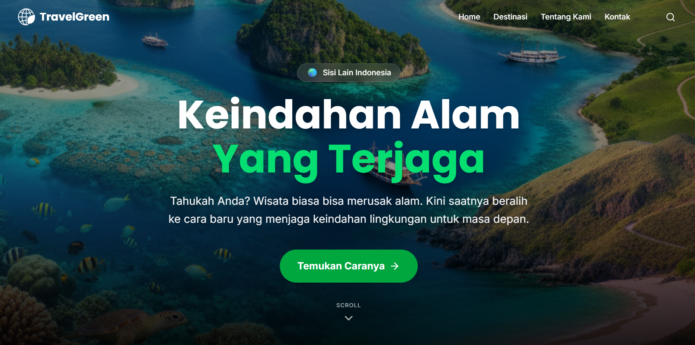

# TravelGreen 🌿 - Web Design Competition Technoversary 2025




> **Tema:** "Eco Digital For Environment"
> **Subtema:** Konservasi Alam dan Ekowisata

## 👨‍💻 Identitas Tim

**Nama Repository:** `webdesign_kapanYah_technoversary25`

* **Nama Tim:** Kapan Yah
* **Asal Instansi:** Politeknik Negeri Jakarta

**Anggota Tim:**
1.  **Raffi Rabbani Widyputra** (Ketua)
2.  **Muhammad Rafli Saputra** (Anggota)

---

## 🌍 Judul & Deskripsi Website

### **Judul Website:** TravelGreen

### **Deskripsi Singkat:**
**TravelGreen** adalah platform berbasis web yang didedikasikan untuk mempromosikan **Pariwisata Berkelanjutan (Sustainable Tourism)** di Indonesia. Di tengah maraknya kerusakan alam akibat *mass tourism*, TravelGreen hadir sebagai media edukasi dan kampanye digital untuk mengajak wisatawan menjadi "Traveler yang Bertanggung Jawab".

Website ini tidak hanya menampilkan keindahan destinasi alam (seperti Raja Ampat, Taman Nasional Komodo, dll), tetapi juga memberikan edukasi mendalam mengenai:
* **Regulasi & Hukum Konservasi:** Undang-undang yang melindungi kawasan.
* **Pedoman Pengunjung:** Apa yang boleh dan dilarang dilakukan demi menjaga ekosistem.
* **Dampak Lingkungan:** Edukasi mengenai jejak karbon dan pelestarian flora/fauna.
* **Pemberdayaan Lokal:** Mengajak wisatawan mendukung ekonomi warga setempat.

Website ini dibangun untuk memenuhi kriteria lomba dengan halaman lengkap: **Home, Destinasi (Konten/Galeri), Tentang Kami (About), dan Kontak.**

---

## 🛠️ Teknologi yang Digunakan

Website ini dibangun menggunakan teknologi modern (Modern Web Stack) tanpa menggunakan template berbayar, sesuai ketentuan lomba.

* **Framework:** [Next.js 14](https://nextjs.org/) (App Router)
* **Language:** [TypeScript](https://www.typescriptlang.org/)
* **Styling:** [Tailwind CSS](https://tailwindcss.com/)
* **Animation:** [Framer Motion](https://www.framer.com/motion/)
* **Icons:** [Lucide React](https://lucide.dev/)
* **Carousel:** [Embla Carousel](https://www.embla-carousel.com/)

---

## 🚀 Petunjuk Instalasi & Menjalankan Project

Ikuti langkah-langkah berikut untuk menjalankan website ini di komputer lokal (Localhost):

### 1. Prasyarat (Prerequisites)
Pastikan Anda sudah menginstal:
* **Node.js** (Versi 18 atau terbaru)
* **Git**

### 2. Clone Repository
Buka terminal/command prompt dan jalankan perintah berikut:

```bash
git clone https://github.com/RenBaelish/webdesign_kapanYah_technoversary25.git
cd webdesign_kapanYah_technoversary25
```

### 3. Instalasi Dependencies
Masuk ke dalam folder project dan install library yang dibutuhkan:

```bash
npm install
# atau jika menggunakan yarn
yarn install
# atau jika menggunakan pnpm
pnpm install
```

### 4. Menjalankan Development Server
Setelah instalasi selesai, jalankan server lokal:

```bash
npm run dev
```

### 5. Buka di Browser
Buka browser Anda dan akses alamat berikut: http://localhost:3000

## 🔗 Link Demo (Hosting)
Lihat aplikasi berjalan secara langsung:

➡️ **[travel-green-jet.vercel.app](https://travel-green-jet.vercel.app/)**

